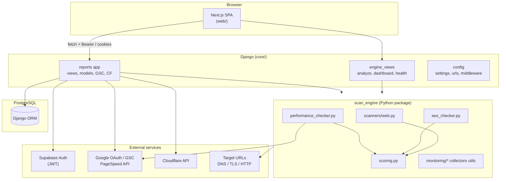

# Monix — Architecture & packages

This document describes how the Monix codebase is structured, which major packages and modules participate in each layer, and how data flows through the system. For quick setup and env variables, see [README.md](README.md). For frontend-only notes, see [web/README.md](web/README.md).

---

## 1. System overview

Monix is a **web security, SEO, and performance** analysis platform. Users register **URLs (targets)**, run **scans**, view **scores and findings**, and optionally connect **Google Search Console** and **Cloudflare** for operational metrics alongside scan data.

| Layer                   | Technology                            | Role                                       |
| ----------------------- | ------------------------------------- | ------------------------------------------ |
| **Web UI**              | Next.js 16, React 19, TypeScript, Bun | Dashboard, auth UI, charts, API client     |
| **API & orchestration** | Django 4.2+, Python 3               | REST JSON, auth, persistence, integrations |
| **Analysis engine**     | Python (`scan_engine`)                | TLS, DNS, HTTP, SEO, PageSpeed, scoring    |
| **Database**            | PostgreSQL                            | Users, targets, scans, encrypted tokens    |

---

## 2. Architecture diagram

---

## 3. Repository layout

| Path                                          | Contents                                                                 |
| --------------------------------------------- | ---------------------------------------------------------------------------------------------------------------------------------------------------------------------------------------------------------------------------------------------------------------------------------------------------------------------------------------- |
| **`core/config/`**                            | Django project: `settings.py` (DB URL parsing, CORS, auth backends), `urls.py`, WSGI/ASGI, custom middleware (`AppendSlashApiMiddleware`), social auth strategy.                                                                                                                                                                          |
| **`core/reports/`**                           | Django app: `models.py` (Target, Scan, GSC/Cloudflare credentials), `views.py` (authenticated product API), `engine_views.py` (scan/monitoring JSON API migrated from legacy Flask), `scan_service.py` (orchestration), `persistence.py` (ORM save), `supabase_auth.py` (JWT/JWKS), `gsc_client.py`, `cloudflare_*`, `scan_service.py`. |
| **`core/scan_engine/`**                       | Pure analysis library: scanners, SEO, performance, scoring, collectors, monitoring, utils (no Django imports required in core paths).                                                                                                                                 |
| **`core/manage.py`**                          | Django entrypoint; `DJANGO_SETTINGS_MODULE=config.settings`.                                                                                                                                                                                                                                                                           |
| **`web/`**                                    | Next.js App Router app: `src/app`, `src/lib/api.ts`, `src/components`, `package.json`, `bun.lock`.                                                                                                                                                                                                                                      |
| **`tests/`**                                  | `pytest` suite (Django + scan engine); see [tests/README.md](tests/README.md).                                                                                                                                                                                                                                                         |
| **`setup.sh`**                                | Venv, migrate, `runserver` (binds `0.0.0.0:8000` for LAN dev), optional admin bootstrap. |
| **`requirements.txt`** / **`pyproject.toml`** | Python dependencies (also declared in `[project]` for installable package).                                                                                                                                                                                                                                                              |

---

## 4. Python / Django packages (backend)

Declared in **`requirements.txt`** and **`pyproject.toml`** `[project.dependencies]`:

| Package                                  | Role in Monix                                                             |
| ---------------------------------------- | ------------------------------------------------------------------------- |
| **Django** (`django>=4.2`)               | ORM, admin, routing, `JsonResponse`, middleware, auth.                    |
| **psycopg2-binary**                      | PostgreSQL driver (`DATABASE_URL`).                                       |
| **django-cors-headers**                  | CORS for browser `fetch` from Next.js origins.                            |
| **django-axes**                          | Admin login rate limiting / lockout.                                      |
| **social-auth-app-django**               | Google OAuth2 backend (parallel to Supabase-only UI flows).               |
| **python-dotenv**                        | Load repo-root `.env` in `settings.py`.                                   |
| **PyJWT** + **cryptography** (via PyJWT) | Verify Supabase JWTs (HS256 tests; RS256/ES256 via JWKS). |
| **requests**                             | HTTP client for PageSpeed, ipinfo, Cloudflare, Google APIs, HTML fetch.   |
| **dnspython**                            | DNS resolution in `scanners/web.py` (optional import path).               |
| **beautifulsoup4**                       | HTML parsing for SEO checks.                                              |
| **psutil**                               | Process / system stats; connection collectors.                            |
| **gunicorn**                             | Production WSGI server.                                                 |

**Editable install** (dev): `pip install -e ".[dev]"` per `pyproject.toml` optional dev deps (pytest, coverage, etc.).

---

## 5. `scan_engine` package map (Python modules)

| Module / package                                                                 | Responsibility                                                                 |
| -------------------------------------------------------------------------------- | ------------------------------------------------------------------------------------------------------------------------ |
| **`scanners/web.py`**                                                            | SSL/TLS via `ssl` + `socket`, HTTP fetch, DNS, security headers, `security.txt`, parallel checks (`ThreadPoolExecutor`). |
| **`seo_checker.py`**                                                             | On-page SEO signals from HTML (`requests` + BeautifulSoup).                                                              |
| **`performance_checker.py`**                                                   | Google PageSpeed Insights API v5; Lighthouse-derived scores and vitals.                                                  |
| **`scoring.py`** | Weighted 0–100 overall score (security / SEO / performance); pass–warn–fail policy.                                     |
| **`analyzers/traffic.py`**                                                       | Path heuristics, bot signatures, log-based summaries.                                                                  |
| **`analyzers/threat.py`**                                                        | Threat-related analysis helpers.                                                                                         |
| **`collectors/connection.py`**                                                   | Connection listing (psutil / OS integration).                                                                              |
| **`collectors/system.py`**                                                       | System stats, top processes. |
| **`monitoring/engine.py`**                                                       | Linux `/proc/net/tcp*` loop, alert thresholds (SYN flood, port scan heuristics).                                          |
| **`monitoring/state.py`** | In-memory alert/state snapshot for dashboard payloads.                                                                   |
| **`utils/geo.py`**, **`utils/network.py`**, **`utils/processes.py`** | GeoIP hooks, TCP state parsing, process mapping. |

**Orchestration** lives in **`reports/scan_service.py`**: `run_full_url_analysis()` calls the scanner, optionally runs SEO + PageSpeed in parallel, applies `calculate_overall_score`, and may call `persistence.save_scan_result()`.

---

## 6. Django apps and HTTP surface

- **`reports`** (product): targets CRUD, scans list, auth profile, GSC connect/callback/sync, Cloudflare connect/zones/analytics, account delete, etc. Uses `_ensure_auth` / Supabase JWT or session depending on configuration.
- **Engine-style routes** in **`engine_views`**: `POST /api/analyze-url/`, `GET /api/dashboard`, `GET /api/health/`, connections/alerts/system-stats, etc. Many are **`csrf_exempt`** JSON endpoints.

**URL routing** is centralized in **`core/config/urls.py`** (includes `social_django.urls` under `/api/auth/`).

---

## 7. Data model (conceptual)

- **`Target`**: UUID PK, `ForeignKey` to `User`, URL, environment, GSC property + cached analytics (`JSONField`).
- **`Scan`**: optional FK to `Target`, unique `report_id` (public share), `score` 0–100, `results` `JSONField` (full engine output), expiry fields.
- **`UserSearchConsoleCredentials`** / **`UserCloudflareCredentials`**: `OneToOne` to `User`; tokens encrypted at rest (Fernet key from env / derived secret).

---

## 8. Frontend stack (`web/`)

| Package                                           | Role                                                                    |
| ------------------------------------------------- | ----------------------------------------------------------------------- |
| **next** (16.x)                                   | App Router, SSR/SSG, route handlers.                                  |
| **react** / **react-dom** (19.x)                  | UI. |
| **typescript**                                    | Type safety.                                                            |
| **tailwindcss** (v4)                              | Styling.                                                                |
| **@supabase/supabase-js**                         | Browser auth; access token sent as `Authorization: Bearer` to Django. |
| **recharts**                                      | Charts.                                                                 |
| **maplibre-gl**                                   | Maps (e.g. scan/geo visualization).                                   |
| **radix-ui**, **framer-motion**, **lucide-react** | Components, motion, icons.                                            |
| **@biomejs/biome**                                | Lint/format (dev).                                                      |

**API client**: `web/src/lib/api.ts` — `djangoApiBase()`, `authHeaders()` / session+credentials patterns (see code and comments for LAN vs localhost behavior).

---

## 9. Authentication flows (reference)

1. **Supabase (default UI path)**  
   User signs in with Supabase; Next.js obtains JWT. API calls include `Authorization: Bearer <access_token>`. Django **`supabase_auth.authenticate_request`** verifies JWT (JWKS or HS256 in tests), maps **`sub`** → **`User.username`**, `get_or_create_user`.

2. **Django session / Google (social_django)**  
   Configured in `settings.py` and `urls.py`; can be used for server-driven OAuth redirects depending on deployment.

---

## 10. Configuration & operations

- **Backend env**: repo-root **`.env`** — `DATABASE_URL` (required), `DJANGO_SECRET_KEY`, `FRONTEND_URL`, Google client ID/secret for GSC/sign-in, optional `PAGESPEED_API_KEY`, Fernet key for token encryption.
- **Frontend env**: **`web/.env.local`** — `NEXT_PUBLIC_SUPABASE_*`, `NEXT_PUBLIC_DJANGO_URL` (optional override).
- **CI** (see root README): Python 3.11 + Postgres for pytest; `bun` + `next build` for web.

---

## 11. Design choices (summary)

- **Synchronous Django + thread pools** for I/O-bound scans instead of async Django views.
- **Engine vs product API** split: `scan_engine` stays importable without HTTP; `scan_service` composes engine + persistence.
- **JSONField** for large scan payloads and GSC cache blobs; normalized columns for queryable metadata.
- **Linux-only monitoring** path (`/proc`) optional for dashboard telemetry; not required for core URL scanning.

---

*Last updated to match repository layout and dependency declarations as of the commit that introduced this file.*
